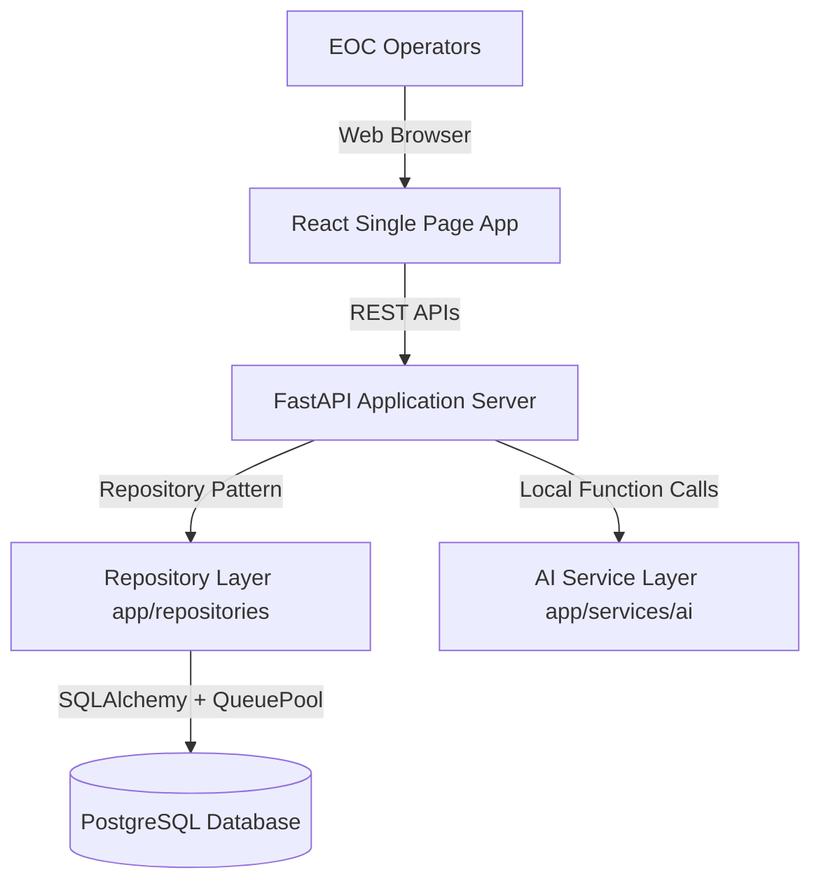

# PROJECT_CONTEXT.md: Terra-Aura Engineering Specification

This document serves as the permanent engineering specification for the Terra-Aura platform. It outlines the architectural blueprints, technical standards, deployment topologies, and roadmap configurations.

---

## 1. Project Vision
Terra-Aura is a production-grade AI Disaster Intelligence Platform. It correlates meteorological signals, social indicators, and spatial sensor feeds in near real-time to compute predictive threat indicators.

Unlike simple CRUD platforms, Terra-Aura operates as an active threat engine:
- **Spatial Processing:** Correlates incidents geographically using spatial dimensions.
- **Predictive Ingest:** Evaluates risk categorization and threat propagation probabilities immediately upon sensor ingestion.
- **Auditable Operations:** Logs operator acknowledgments and system settings for emergency audit trails.

Target users include EOC operators, climate analysts, and field teams. The codebase serves as a showcase portfolio demonstrating robust software engineering, modular monolith patterns, and modern DevOps configurations.

---

## 2. Current Architecture
The platform is structured as a **Modular Monolith** containing isolated domains for web APIs, machine learning pipelines, and relational storage.



- **Frontend Client:** React SPA communicating with backend services via REST.
- **FastAPI Application Server:** Exposes routing controllers. Contains versioned APIs (`/api/v1/...`) and root-level legacy handlers.
- **Repository Layer:** Decouples API endpoints from raw ORM statements. Encapsulates transaction operations.
- **AI Service Layer:** Decoupled model inference layer. Manages configuration prompts, caching, ONNX runtimes, and retry flows.
- **Database Layer:** Normalized PostgreSQL database storing historical events, alerts, and reports. Managed by Alembic.

---

## 3. Technology Stack

### Frontend
- **Framework:** React 19.x (Single Page App)
- **Maps:** Leaflet 1.9.x / React-Leaflet 5.x
- **HTTP Client:** Axios 1.13.x
- **Styling:** Vanilla CSS (curated high-contrast color variables)

### Backend
- **Framework:** FastAPI 0.124.x
- **Web Server:** Uvicorn 0.38.x
- **ORM:** SQLAlchemy 2.0.x (Synchronous configuration)
- **Validation:** Pydantic 2.12.x / Pydantic-Settings 2.14.x

### Database & Migrations
- **Engine:** PostgreSQL 15-alpine
- **Adapter:** psycopg2-binary 2.9.x
- **Migrations:** Alembic 1.18.x

### AI & Inference
- **Inference Engines:** ONNX Runtime / CPU Simulation fallback layers
- **Abstractions:** Shared inference interfaces (`BaseAIModel`)
- **Libraries:** NumPy, Pandas, Scikit-learn, PyTorch, OpenCV-python (declared in requirements)

### DevOps & Tooling
- **Orchestration:** Docker / Docker Compose
- **Quality Assurance:** Pre-commit hooks (Black, Ruff, ESLint, Prettier)
- **Version Control:** Git

---

## 4. Folder Structure
The repository is organized cleanly by domain boundaries:

```txt
/
├── .github/workflows/      # Future CI/CD configurations
├── .gitignore              # Root Git exclusion specifications
├── .pre-commit-config.yaml # Pre-commit hook definitions
├── docker-compose.yml      # Service orchestration manifest
├── docs/                   # Engineering design documents
├── ml/                     # ML code, sample data, and inference logic
│   ├── inference/
│   │   └── predict.py      # ML Rules proxy (original reference baseline)
│   └── Requirements.txt    # ML dependencies
├── backend/
│   ├── alembic/            # Database migration history
│   ├── alembic.ini         # Alembic configuration metadata
│   ├── Dockerfile          # Multi-stage Python build script
│   ├── requirements.txt    # API dependency definitions
│   ├── .env.example        # Environment settings template
│   ├── .env                # Local secrets configuration
│   ├── tests/
│   │   ├── test_auth.py    # Zero-dependency auth tests
│   │   └── test_ai.py      # Lazy load, cache, and batch tests
│   └── app/
│       ├── main.py         # FastAPI lifespan bootloader and app assembly
│       ├── db.py           # Engine pool and connection retry logic
│       ├── db_seeder.py    # Automated database seeder
│       ├── dependencies.py # Context dependencies (auth & RBAC check)
│       ├── core/           # Core cross-cutting modules
│       │   ├── config.py   # Settings validation
│       │   ├── logging.py  # Structured logger configurations
│       │   ├── response.py # JSON response envelopes
│       │   ├── exceptions.py # Global handlers
│       │   ├── rate_limit.py # Sliding-window rate limiter
│       │   └── security.py # Password hash and JWT utils
│       ├── models/         # SQLAlchemy models (disaster, alert, report, user, audit_log)
│       ├── schemas/        # Validation schemas
│       ├── repositories/   # Entity repositories (disaster_repository, user_repository)
│       ├── services/       # Core business logic handlers
│       │   ├── ml_service.py # Core ML mapping and caching logic
│       │   └── ai/         # Unified AI Service Layer
│       │       ├── base.py       # Base AI model abstraction interface
│       │       ├── config.py     # Prompt, paths, and serving configurations
│       │       ├── caching.py    # TTL-aware prediction cache
│       │       ├── onnx_layer.py # ONNX wrapper and exponential backoff retry
│       │       ├── factory.py    # Singleton model factories
│       │       ├── satellite.py  # Satellite classification stubs (supports batching)
│       │       ├── weather.py    # Weather forecasts models stubs
│       │       ├── tweet_nlp.py  # Text parsing models stubs
│       │       └── gemini_rag.py # Gemini generative reporting stubs
│       └── routers/        # FastAPI endpoint controllers (disaster, auth, health)
└── frontend/
    ├── Dockerfile          # Nginx-based React production build
    ├── package.json        # Node modules and scripts
    └── src/                # React client sources
```

---

## 5. Database Design

### Normalized Schemas
1. **disasters Table:**
   - `id` (Integer, Primary Key)
   - `disaster_type` (String, Indexed)
   - `severity_score` (Float)
   - `risk_level` (String, Indexed)
   - `population_at_risk` (Integer)
   - `confidence` (Float)
   - `latitude` (Float)
   - `longitude` (Float)
   - `created_at` (DateTime, Indexed)
2. **alerts Table:**
   - `id` (Integer, Primary Key)
   - `disaster_id` (Integer, ForeignKey to `disasters.id` with CASCADE delete, Indexed)
   - `level` (String, Indexed)
   - `title` (String)
   - `description` (String, Nullable)
   - `escalation_probability` (Float)
   - `acknowledged` (Boolean, Default=False)
   - `created_at` (DateTime, Indexed)
3. **reports Table:**
   - `id` (Integer, Primary Key)
   - `report_code` (String, Unique, Indexed)
   - `disaster_id` (Integer, ForeignKey to `disasters.id` with CASCADE delete, Indexed)
   - `type` (String, Indexed)
   - `risk` (String, Indexed)
   - `location` (String)
   - `status` (String, Indexed)
   - `summary` (String, Nullable)
   - `created_at` (DateTime, Indexed)
4. **users Table:**
   - `id` (Integer, Primary Key)
   - `name` (String)
   - `email` (String, Unique, Indexed)
   - `hashed_password` (String)
   - `role` (String, Default="ANALYST", Indexed)
   - `clearance_level` (String, Default="Alpha")
   - `is_active` (Boolean, Default=True)
   - `is_verified` (Boolean, Default=False)
   - `verification_token` (String, Indexed, Nullable)
   - `password_reset_token` (String, Indexed, Nullable)
   - `failed_login_attempts` (Integer, Default=0)
   - `lockout_until` (DateTime, Nullable)
   - `current_refresh_token` (String, Nullable)
   - `created_at` (DateTime, Indexed)
   - `updated_at` (DateTime)
5. **audit_logs Table:**
   - `id` (Integer, Primary Key)
   - `user_email` (String, Indexed)
   - `action` (String, Indexed)
   - `entity_type` (String, Nullable)
   - `entity_id` (Integer, Nullable)
   - `ip_address` (String, Nullable)
   - `created_at` (DateTime, Indexed)

### Transaction Check Constraints
Integrity constraints are enforced at the database layer via SQLAlchemy check constraints:
- `check_latitude_bounds`: `latitude >= -90.0 AND latitude <= 90.0`
- `check_longitude_bounds`: `longitude >= -180.0 AND longitude <= 180.0`
- `check_severity_bounds`: `severity_score >= 0.0 AND severity_score <= 1.0`
- `check_confidence_bounds`: `confidence >= 0.0 AND confidence <= 1.0`
- `check_population_bounds`: `population_at_risk >= 0`
- `check_risk_level_values`: `risk_level IN ('LOW', 'MEDIUM', 'HIGH', 'CRITICAL')`
- `check_escalation_bounds`: `escalation_probability >= 0.0 AND escalation_probability <= 100.0`
- `check_alert_level_values`: `level IN ('LOW', 'MEDIUM', 'HIGH', 'CRITICAL')`
- `check_report_risk_values`: `risk IN ('low', 'medium', 'high', 'critical')`
- `check_report_status_values`: `status IN ('active', 'monitoring', 'resolved')`
- `check_user_roles`: `role IN ('ANALYST', 'EOC_LEAD', 'ADMINISTRATOR')`
- `check_clearance_levels`: `clearance_level IN ('Alpha', 'Beta', 'Omega')`

### Connection Pooling & Resiliency
- Managed via `QueuePool` with parameters: `pool_size=10`, `max_overflow=20`, `pool_recycle=1800`, `pool_pre_ping=True`.
- Development bypass: engine builder detects SQLite protocols (e.g. `sqlite://`) and automatically configures single-thread connection overrides, avoiding pool-size errors.
- Retry Loop: `wait_for_db` queries PostgreSQL at startup with exponential backoff to handle container launch delays.

---

## 6. API Design Principles

### Path Versioning
New endpoints are mounted under the `/api/v1` namespace. Legacy routes are maintained at the root for backward compatibility.

### Standard Response Envelope
All versioned endpoint payloads conform to this envelope structure:
```json
{
  "success": true,
  "data": {},
  "error": null,
  "timestamp": "2026-07-05T06:07:20Z"
}
```

### Global Error Handling
Global handlers catch `HTTPException`, validation errors (`RequestValidationError`), and system failures, formatting them into the response envelope with clean message logs.

---

## 7. AI Pipeline
The AI Pipeline is decoupled from routing parameters to establish a modular inference layer:
- **Unified Interface Contract:** All models inherit from `BaseAIModel`, implementing `load_model()` and `predict(input_data)`.
- **Lazy Loading Optimization:** Models defer file loading until first prediction execution, accelerating server boot sequences.
- **ONNX Compatibility Session Wrapper:** Encapsulates ONNX initialization. Automatically falls back to NumPy CPU simulations when weights files or `onnxruntime` bindings are absent.
- **Exponential Backoff Recovery:** Forward execution queries are wrapped in the `execute_with_retry` helper, preventing minor connection blips from throwing API-level failures.
- **TTL Caching:** Predictions are cached by hashing input properties. Matches are served in 0ms, boosting API throughput.
- **Request Batching:** The Satellite Classification model exposes batching inputs (`predict_batch`) to process multiple coordinate calculations in a single sweep.
- **External Serves Compatibility:** Swapping configuration metrics redirects prediction targets from local session runtimes to Ray Serve or Triton endpoints.

---

## 8. Authentication Strategy
The authentication layer enforces secure token-based user sessions:
- **JWT Architecture:** HS256-signed JSON Web Tokens. Access tokens expire in 15 minutes; refresh tokens expire in 7 days.
- **Secure Cookie Transports:** Access and refresh tokens are written to client responses as secure, HTTP-only, `SameSite=lax` cookies.
- **Refresh Token Rotation (RTR):** Refreshes emit a new refresh token. Reusing an old refresh token is detected as a session compromise, which immediately revokes all active refresh tokens for the user, forcing a complete re-login.
- **Account Lockout:** Tracks failed sign-in attempts. Recording 5 consecutive failed login attempts locks the user account for 15 minutes.
- **Lockout Release:** Successful verification and password reset immediately resets failed attempt counters to 0 and clears lock timestamps.
- **Role-Based Access Control (RBAC):** Restricts versioned routers using the `RequireRole` dependency check (evaluates `ANALYST`, `EOC_LEAD`, or `ADMINISTRATOR` access credentials).
- **Audit Logging:** Logs key authentication and verification actions to the `audit_logs` table.

---

## 9. Background Processing
- *Pending Implementation*
- **Planned Target:** Offload weather polling and RAG compilation to Celery workers backed by a Redis message broker.

---

## 10. RAG Pipeline
- *Pending Implementation*
- **Planned Target:** Process historical disaster alerts and operational logs, index them in ChromaDB as vector embeddings, and retrieve relevant logs for Gemini LLM context to compile situation reports.

---

## 11. Infrastructure
Services run in isolated Docker containers linked via docker-compose networking:
- **disaster_db:** Postgres 15 database instance using volume mounting for persistence.
- **disaster_backend:** FastAPI application server running Uvicorn.
- **disaster_frontend:** React SPA served via Nginx.

---

## 12. Deployment Strategy
- **Local Dev:** Launched via `docker-compose up --build` or manual python execution.
- **Production Target:** Deployed on Render (backend), hosted on Vercel (frontend), and database hosted on Supabase Postgres.

---

## 13. Environment Variables
Defined in `.env` and settings configurations:
- `ENV` (e.g. `development`, `production`)
- `LOG_LEVEL` (e.g. `INFO`, `WARNING`)
- `DATABASE_URL` (SQLAlchemy postgresql connection string)
- `JWT_SECRET_KEY` (Access token signing secret)
- `JWT_REFRESH_SECRET_KEY` (Refresh token signing secret)

---

## 14. Coding Standards
- **Python:** PEP 8 styling. Formatted via Black and linted via Ruff.
- **JavaScript:** ESLint lint rules and Prettier formatting.
- **Commits:** Conventional Commits: `type(scope): message`.

---

## 15. Current Limitations
- AI module is limited to simulation model stubs.
- Frontend dashboard metrics represent static local arrays, not linked to APIs.
- Background task queuing is pending setup.

---

## 16. Future Roadmap
- **Phase 1:** Core Production Infrastructure Upgrade (Completed).
- **Phase 2:** Persistence Layer Optimization & Normalization (Completed).
- **Phase 3:** Production-Grade Authentication & Access Controls (Completed).
- **Phase 4:** AI Layer Upgrade & Inference Abstraction (Completed).
- **Phase 5:** API integration with frontend templates and real-time weather polling.
- **Phase 6:** RAG compilation framework (ChromaDB + Gemini).
- **Phase 7:** Model serving pipeline (ONNX Runtime).

---

## 17. Decisions Made
- **Bcrypt Package Direct Dependency:** Bypassed `passlib` entirely for hashing credentials. Directly invoked the `bcrypt` package to avoid the unmaintained `passlib` layer's type errors and compatibility issues in modern Python 3.13 runtimes.
- **Decoupled AI Layer:** Separated ML inference logic from FastAPI router controllers by constructing a dedicated `AIFactory` layer.
- **Programmatic Model Lazy Loading:** Implemented deferred model loading until first prediction runtime to optimize API server start speeds.
- **ONNX CPU Fallbacks:** Engineered ONNX sessions to support numpy calculations when session initialization libraries are absent.
- **Centralized Prompt Configs:** Managed RAG prompts inside settings properties to keep routes clean.

---

## 18. Breaking Changes
- No breaking changes were introduced. Legacy unwrapped paths remain operational.

---

## 19. Pending Work
- Connect the frontend pages to the new backend API endpoints using Axios fetch hooks.
- Set up Celery background processing workers.

---

## 20. Production Readiness Checklist
- [x] Environment variables validated (Pydantic-Settings).
- [x] Production connection pooling enabled (QueuePool).
- [x] Check constraints and relational integrity constraints enforced at database layer.
- [x] Versioned migrations configured (Alembic).
- [x] Automatic database migration and seeding on startup completed.
- [x] Standard API envelopes and global error handlers active.
- [x] Multi-container orchestration defined (Docker Compose).
- [x] JWT access/refresh token rotation and secure cookie transports enabled.
- [x] Role-Based Access Control checks implemented.
- [x] Security headers middleware and login rate limiting active.
- [x] Decoupled AI Service Layer interface and lazy model loaders operational.
- [x] ONNX session cpu provider loading and numpy fallback stubs configured.
- [x] Prediction caching and exponential backoff retry loops active.
- [ ] Real ML model weights serving active.
- [ ] Telemetry logging and daily backup schemes configured.
