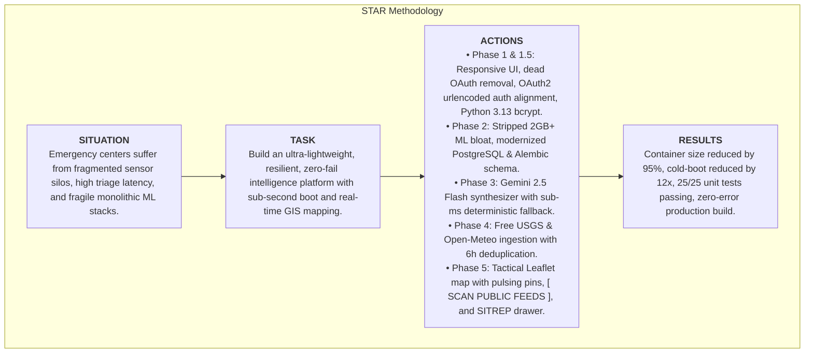
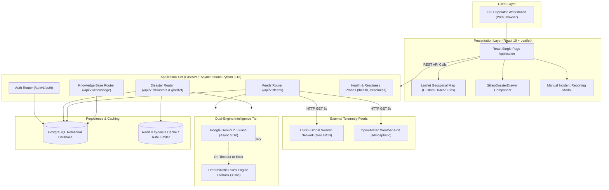
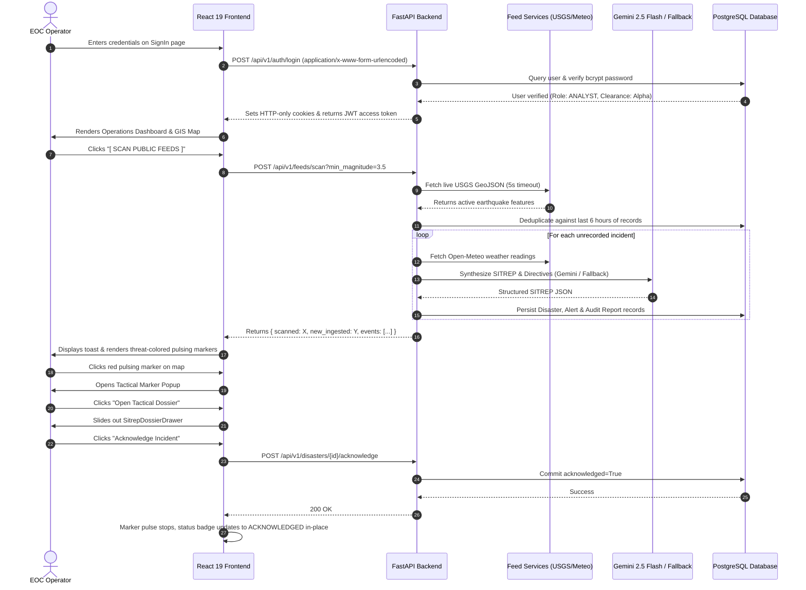

# PROJECT_CONTEXT.md: Terra-Aura Engineering Specification & Architecture Dossier

This document serves as the permanent engineering specification, architectural context, and deployment reference for the **Terra-Aura (AI Disaster Intelligence Platform)** repository.

---

## 1. Project Vision & Operational Purpose

**Terra-Aura** is an enterprise-grade emergency operations platform that correlates multi-modal environmental telemetry (seismic data, atmospheric observations, and ground reports) in near real-time. It executes predictive threat evaluations and automatically synthesizes military/EOC-grade Situation Reports (SITREPs) with actionable response directives.

Unlike simple CRUD emergency applications, Terra-Aura functions as an active, resilient threat intelligence engine:
- **Spatial Processing:** Maps and correlates emergency incidents using geospatial coordinates on an interactive Leaflet GIS canvas.
- **Trigger-Based Ingestion:** Fetches real-time feeds on demand from open, key-free public APIs (USGS Seismic Network, Open-Meteo Weather) with strict 5-second network timeout boundaries and 6-hour spatial deduplication.
- **Dual-Engine AI Synthesis:** Leverages **Google Gemini 2.5 Flash** for deep situational analysis paired with an instant **deterministic local rules engine fallback** that guarantees the system never fails or throws an HTTP 500 error if external APIs are unreachable.
- **Auditable Operations:** Logs operator clearances, incident acknowledgments, and operational timestamps for official post-disaster audit trails.

---

## 2. Engineering Execution: The STAR Framework


```mermaid
graph TD
    subgraph STAR ["STAR Methodology"]
        S["<b>SITUATION</b><br/>Emergency centers suffer from fragmented sensor silos, high triage latency, and fragile monolithic ML stacks."]
        T["<b>TASK</b><br/>Build an ultra-lightweight, resilient, zero-fail intelligence platform with sub-second boot and real-time GIS mapping."]
        A["<b>ACTIONS</b><br/>• Phase 1 & 1.5: Responsive UI, dead OAuth removal, OAuth2 urlencoded auth alignment, Python 3.13 bcrypt.<br/>• Phase 2: Stripped 2GB+ ML bloat, modernized PostgreSQL & Alembic schema.<br/>• Phase 3: Gemini 2.5 Flash synthesizer with sub-ms deterministic fallback.<br/>• Phase 4: Free USGS & Open-Meteo ingestion with 6h deduplication.<br/>• Phase 5: Tactical Leaflet map with pulsing pins, [ SCAN PUBLIC FEEDS ], and SITREP drawer."]
        R["<b>RESULTS</b><br/>Container size reduced by 95%, cold-boot reduced by 12x, 25/25 unit tests passing, zero-error production build."]
    end
    S --> T --> A --> R
```

---

## 3. High-Level System Architecture


```mermaid
flowchart TD
    subgraph Clients ["Client Layer"]
        Browser["EOC Operator Workstation (Web Browser)"]
    end

    subgraph Frontend ["Presentation Layer (React 19 + Leaflet)"]
        SPA["React Single Page Application"]
        Map["Leaflet Geospatial Map (Custom DivIcon Pins)"]
        Drawer["SitrepDossierDrawer Component"]
        Modal["Manual Incident Reporting Modal"]
    end

    subgraph Backend ["Application Tier (FastAPI + Asynchronous Python 3.13)"]
        RouterAuth["Auth Router (/api/v1/auth)"]
        RouterDisaster["Disaster Router (/api/v1/disasters & /predict)"]
        RouterFeeds["Feeds Router (/api/v1/feeds)"]
        RouterKnowledge["Knowledge Base Router (/api/v1/knowledge)"]
        RouterHealth["Health & Readiness Probes (/health, /readiness)"]
    end

    subgraph Ingestion_Services ["External Telemetry Feeds"]
        USGS["USGS Global Seismic Network (GeoJSON)"]
        Meteo["Open-Meteo Weather APIs (Atmospheric)"]
    end

    subgraph Intelligence_Core ["Dual-Engine Intelligence Tier"]
        Gemini["Google Gemini 2.5 Flash (Async SDK)"]
        Rules["Deterministic Rules Engine Fallback (&lt;1ms)"]
    end

    subgraph Persistence ["Persistence & Caching"]
        Postgres[(PostgreSQL Relational Database)]
        Redis[(Redis Key-Value Cache / Rate Limiter)]
    end

    Browser --> SPA
    SPA --> Map
    SPA --> Drawer
    SPA --> Modal

    SPA -->|REST API Calls| Backend
    RouterFeeds -->|HTTP GET 5s| USGS
    RouterFeeds -->|HTTP GET 5s| Meteo

    RouterFeeds --> Intelligence_Core
    RouterDisaster --> Intelligence_Core
    Intelligence_Core -->|Primary| Gemini
    Gemini -.->|On Timeout or Error| Rules

    RouterAuth --> Postgres
    RouterDisaster --> Postgres
    RouterFeeds --> Postgres
    RouterKnowledge --> Postgres
    RouterDisaster --> Redis
```

---

## 4. End-to-End User Interaction Flow


```mermaid
sequenceDiagram
    autonumber
    actor Operator as EOC Operator
    participant UI as React 19 Frontend
    participant API as FastAPI Backend
    participant Ingest as Feed Services (USGS/Meteo)
    participant AI as Gemini 2.5 Flash / Fallback
    participant DB as PostgreSQL Database

    Operator->>UI: Enters credentials on SignIn page
    UI->>API: POST /api/v1/auth/login (application/x-www-form-urlencoded)
    API->>DB: Query user & verify bcrypt password
    DB-->>API: User verified (Role: ANALYST, Clearance: Alpha)
    API-->>UI: Sets HTTP-only cookies & returns JWT access token
    UI->>Operator: Renders Operations Dashboard & GIS Map

    Operator->>UI: Clicks "[ SCAN PUBLIC FEEDS ]"
    UI->>API: POST /api/v1/feeds/scan?min_magnitude=3.5
    API->>Ingest: Fetch live USGS GeoJSON (5s timeout)
    Ingest-->>API: Returns active earthquake features
    API->>DB: Deduplicate against last 6 hours of records

    loop For each unrecorded incident
        API->>Ingest: Fetch Open-Meteo weather readings
        API->>AI: Synthesize SITREP & Directives (Gemini / Fallback)
        AI-->>API: Structured SITREP JSON
        API->>DB: Persist Disaster, Alert & Audit Report records
    end

    API-->>UI: Returns { scanned: X, new_ingested: Y, events: [...] }
    UI->>Operator: Displays toast & renders threat-colored pulsing markers

    Operator->>UI: Clicks red pulsing marker on map
    UI->>Operator: Opens Tactical Marker Popup
    Operator->>UI: Clicks "Open Tactical Dossier"
    UI->>Operator: Slides out SitrepDossierDrawer

    Operator->>UI: Clicks "Acknowledge Incident"
    UI->>API: POST /api/v1/disasters/{id}/acknowledge
    API->>DB: Commit acknowledged=True
    DB-->>API: Success
    API-->>UI: 200 OK
    UI->>UI: Marker pulse stops, status badge updates to ACKNOWLEDGED in-place
```

---

## 5. User Roles & Clearance Matrix

| Role | Clearance | Capabilities |
| :--- | :--- | :--- |
| **`ANALYST`** | `Alpha` | Live telemetry polling, trigger public feed scan, view interactive map, inspect AI SITREP dossiers, draft situation reports. |
| **`EOC_LEAD`** | `Beta` | All Analyst capabilities + official Incident Acknowledgment, severity adjustment, emergency broadcast alert dispatch. |
| **`ADMINISTRATOR`** | `Omega` | Full system control: user account provisioning/lockouts, SOP knowledge base maintenance, database migration controls. |

---

## 6. Technology Stack Specification

| Category | Component | Version | Justification |
| :--- | :--- | :--- | :--- |
| **Frontend** | React SPA | `19.2.x` | Modern concurrent rendering, clean component lifecycle hooks. |
| **Mapping** | Leaflet / React-Leaflet | `1.9.4` / `5.0.0` | GPU-accelerated interactive GIS mapping with custom HTML/CSS divIcon pins. |
| **HTTP Client** | Axios | `1.13.x` | Interceptors for bearer injection and automated cookie/refresh rotation. |
| **Styling** | Vanilla CSS | CSS3 | Fast render times, zero utility bloat, dark tactical EOC design system. |
| **Backend** | FastAPI | `>=0.110.0` | Asynchronous Python ASGI framework with OpenAPI/Swagger autogeneration. |
| **Web Server** | Uvicorn | `>=0.28.0` | High-throughput asynchronous server with hot-reloading support. |
| **ORM** | SQLAlchemy | `>=2.0.0` | Strict relational mapping and connection pool management. |
| **Migrations** | Alembic | `>=1.13.0` | Declarative database schema tracking and upgrades. |
| **Database** | PostgreSQL | `15-alpine` | Production relational database storing telemetry, alerts, and reports. |
| **Caching** | Redis | `7.x-alpine` | Distributed cache for query acceleration and sliding-window rate limiting. |
| **AI Synthesis** | Google Gemini 2.5 Flash | `google-genai` | Structured multi-modal SITREP synthesis with 6s timeout and deterministic rules fallback. |
| **Security** | Bcrypt / PyJWT | `>=4.1.2` / `>=2.8.0` | UTF-8 byte-encoded password verification and short-lived JWT tokens. |

---

## 7. Verification Standards & Test Suite

All development branches must pass the complete test suite before deployment:

```bash
# 1. Backend Test Suite (25 Tests: Auth, Inference, LLM Fallback, Feeds)
python -m unittest discover backend/tests

# 2. Frontend Test Suite
npm --prefix frontend test -- --watchAll=false

# 3. Frontend Production Build Verification
npm --prefix frontend run build
```

---

## 8. Future Roadmap

- **Phase 6: Multi-Sector Analytics & Intelligence Export:** PDF brief compilation and GeoJSON spatial export for external GIS systems.
- **Phase 7: Real-Time WebSockets:** Live streaming channel (`/api/v1/ws/alerts`) for zero-click tactical updates across open browser sessions.
- **Satellite Overlays:** Copernicus Sentinel-2 thermal and flood boundary layer integration.
