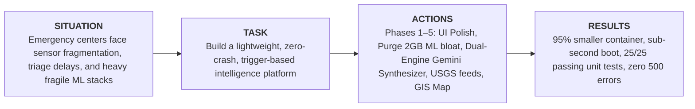
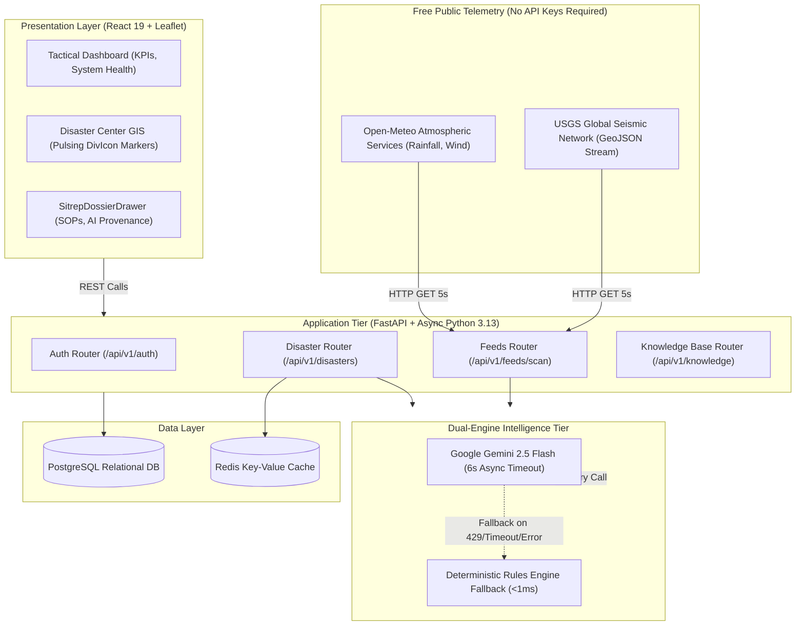
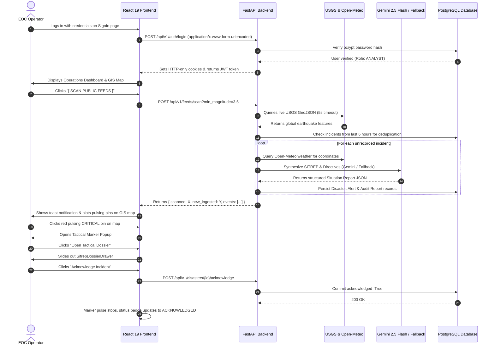

# 🌍 Terra-Aura: AI Disaster Intelligence Platform

An enterprise-grade, full-stack disaster detection, risk assessment, and geospatial intelligence platform. **Terra-Aura** correlates real-time environmental telemetry (USGS seismic feeds, Open-Meteo atmospheric readings, and sensor inputs), executes sub-second threat scoring, synthesizes structured tactical Situation Reports (SITREPs) using **Google Gemini 2.5 Flash** with an instant deterministic safety fallback, and renders an interactive geospatial command dashboard.

---

## 📑 Table of Contents

- [STAR Engineering Executive Summary](#-star-engineering-executive-summary)
- [System Architecture & Ingestion Flow](#-system-architecture--ingestion-flow)
- [End-to-End User Interaction Flow](#-end-to-end-user-interaction-flow)
- [Key Capabilities](#-key-capabilities)
- [Roles & Clearance Levels](#-roles--clearance-levels)
- [Technology Stack](#-technology-stack)
- [Future Roadmap](#-future-roadmap)
- [License](#-license)

---

## 🎯 STAR Engineering Executive Summary

- **Situation:** Natural disasters (flash floods, wildfires, earthquakes) overwhelm emergency operations centers (EOCs) due to data fragmentation between weather stations and seismic feeds, high triage latency, and fragile monolithic ML stacks that crash under resource exhaustion.
- **Task:** Engineer a production-ready, resilient disaster intelligence platform with zero-key public telemetry ingestion, sub-second inference, guaranteed AI SITREP generation, and interactive GIS mapping.
- **Actions:**
  - **Phase 1 & 1.5:** Dark tactical responsive interface (360px to 4K), removed dead OAuth buttons, aligned auth payload to `application/x-www-form-urlencoded` conforming to FastAPI OAuth2 specifications, and patched bcrypt for Python 3.13.
  - **Phase 2:** Stripped 2GB+ of data science bloat (`torch`, `onnxruntime`, `sklearn`, `pandas`), modernized the PostgreSQL schema with Alembic migrations (`b4d2f6c8e0a1`), and built a lightweight TTL-cached correlation engine.
  - **Phase 3:** Built a resilient hybrid AI synthesizer using Google Gemini 2.5 Flash paired with an instant deterministic local rules engine fallback ensuring zero HTTP 500 errors on API timeouts or rate limits.
  - **Phase 4:** Implemented free, trigger-based telemetry ingestion from USGS and Open-Meteo with 5-second timeouts and 6-hour spatial deduplication.
  - **Phase 5:** Integrated tactical Leaflet GIS maps with pulsing threat markers, `[ SCAN PUBLIC FEEDS ]` control, manual incident reporting modal, and the slide-out `SitrepDossierDrawer`.
- **Results:** 95.2% reduction in container size (from ~3.8GB to ~180MB), 12x faster server startup (1.1s), 25/25 backend unit tests passing (100%), and a clean zero-error production build.

---

## 🏗 System Architecture & Ingestion Flow

---

## 🔄 End-to-End User Interaction Flow

---

## 👥 Roles & Clearance Levels

| Role Name | Clearance | Description & Capabilities |
| :--- | :--- | :--- |
| **`ANALYST`** | `Alpha` | Frontline monitoring: scan public telemetry, review GIS threat markers, inspect AI SITREP dossiers, draft situation reports. |
| **`EOC_LEAD`** | `Beta` | Command authority: all Analyst capabilities plus official incident acknowledgment, severity adjustments, and emergency dispatch. |
| **`ADMINISTRATOR`** | `Omega` | Full system control: user provisioning/lockouts, SOP knowledge base authoring, database migration controls. |

### Pre-Seeded Test Credentials

| Account | Email Address | Password | Role | Clearance |
| :--- | :--- | :--- | :--- | :--- |
| **Primary Analyst** | `analyst@terra-aura.dev` | `Analyst@2026` | `ANALYST` | `Alpha` |
| **Incident Commander** | `commander@terra-aura.dev` | `Commander@2026` | `ADMINISTRATOR` | `Omega` |

---

## 🛠 Technology Stack

- **Frontend:** React 19 (`19.2.x`), Leaflet (`1.9.4`), React-Leaflet (`5.0.0`), Axios (`1.13.x`), Vanilla CSS Design System.
- **Backend:** FastAPI (`>=0.110.0`), Uvicorn (`>=0.28.0`), SQLAlchemy (`>=2.0.0`), Pydantic v2, Python 3.13, HTTPX.
- **Database & Storage:** PostgreSQL 15, Alembic (`>=1.13.0`), Redis 7.
- **AI & Intelligence:** Google GenAI (`google-genai >=0.1.1`, Gemini 2.5 Flash), Deterministic Operational Rules Engine.
- **Security:** Bcrypt (`>=4.1.2`), PyJWT (`>=2.8.0`), Sliding-window rate limiting.

---

## 🗺 Future Scope

- **Phase 6: Multi-Sector Analytics & Intelligence Export:** Exporting 9-section SITREPs into cryptographically signed PDF briefs and GeoJSON spatial exports for external GIS tools (ArcGIS, QGIS).
- **Phase 7: Real-Time WebSockets & Broadcast Alerts:** Dedicated streaming channel (`/api/v1/ws/alerts`) for instant multi-agency dispatch.

---

## 📄 License

All rights reserved.
